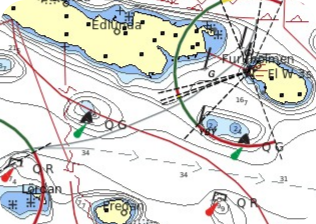
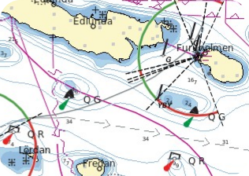
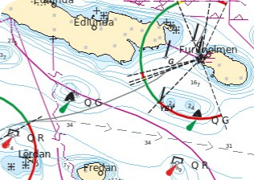
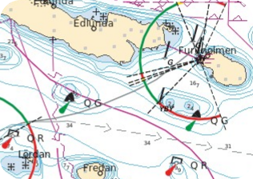
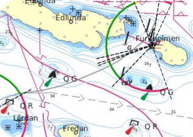

# Colors and symbols

**A variety of color schemes and symbols for a different look and feel for vector based charts in [OpenCPN](https://opencpn.org) .**

The files in this repository are intended as an example of how to change the colors and symbols for vector based charts in OpenCPN.

These files are tested in OpenCPN 5.2.4 on Linux. Other platforms should work and maybe also earlier or later versions.

## Included files

The different chartsymbols.xml files holds data of the different colors used in the charts and also data of which symbols are to be used to show objects in the chart. The actual symbols resides in "common/rastersymbols-day.png"

The file "master/changed symbols.txt" contains information about changed symbols.

The "master/rastersymbols.xcf" file have all symbols and different layers to prduce the png files "...day.png", "...dusk.png" and "...dark.png". Use [Gimp](https://www.gimp.org/) to edit the file.

"[resources/settings.md](resources/settings.md)" contains some tips and examples of settings that have an impact on the vector charts.

## How to use

1. Find the "s57data" directory of your OpenCPN installation.
   
   - Windows - E.g. `C:\Program Files (x86)\OpenCPN\s57data`
   - Mac - E.g. `/Applications/OpenCPN.app/Contents/SharedSupport/s57data`
   - Linux - E.g. `/usr/share/opencpn/s57data`

2. Make a backup copy to a safe location of the files
   
   - rastersymbols-day.png
   
   - rastersymbols-dusk.png
   
   - rastersymbols-dark.png 
   
   - chartsymbols.xml
     
     in the ""s57data"" folder

3. Copy the files "rastersymbols...png" from this repository to the "s57data" folder.

4. Copy the file "chartsymbols.xml" of your choice from this repository to the "s57data" folder.

5. (Re)-Start OpenCPN.

6. Optional. See the [settings.md](resources/settings.md) on how to use the included template.

## Included style examples

#### Swedish Classic

#### Swedish Digital 1

#### Swedish Digital 2

#### Swedish Modern

#### Nordic Electronic 1

