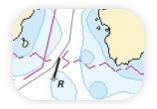
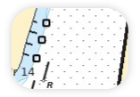
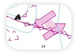

# Some useful settings for Swedish vector charts

## Template

There is a template included in "resources/". To use it, copy the file "resources/OCPNTemplate-6cd87037-2b2f-4c50-9750-776764636100.conf" to your "config" directory and edit the "configs.xml" and paste the **contents** of the file "resources/template.xml" in between the `<configs> <configs/>` tags.

(Re-)Start OpenCPN and go to Options -> Display -> Templates. The added template "Swedish Charts" should be in the list. The setting below (except the fonts) should be in the template.

## User standard objects

In OpenCPN it is, for some objects/symbols, possible to choose if they should be visible or not.
Have a look in Options -> Charts -> Vector Chart Display -> User Standard Objects.

Many of the objects in this list seem to have no effect in Swedish vector charts. Below are some of the objects that do have an impact and examples of how they appear in the charts.

| Setting                             | On                                                                         | Off                                                                         |
| ----------------------------------- | -------------------------------------------------------------------------- | --------------------------------------------------------------------------- |
| Anchorage area                      |                       |                       |
| Beacon special purpose/general      |       |       |
| Building single                     |                      |                      |
| Built-up area                       |                        |                        |
| Buoy cardinal                       |                        |                        |
| Buoy isolated danger                |                 |                 |
| Buoy lateral                        |                         |                         |
| Buoy special purpose/general        |         |         |
| Cable submarine                     |                      |                      |
| Caution area                        |                         |                         |
| Crane                               |                                |                                |
| Depth contour                       |                        |                        |
| Dregded area                        |                         |                         |
| Dumping ground                      |                       |                       |
| Ferry route                         |                          |                          |
| Harbour facility                    |                     |                     |
| Land region                         |                          |                          |
| Landmark                            |                             |                             |
| Magnetic variation                  |                   |                   |
| Marine farm/culture                 |                  |                  |
| Navigation line                     |                      |                      |
| Offshore production area            |             |             |
| Pilot boarding place                |                 |                 |
| Recommended track                   |                    |                    |
| Restricted area                     |                      |                      |
| Road                                |                                 |                                 |
| Sea area/Named wate -area           |            |            |
| Silo/Tank                           |                            |                            |
| Swept area                          |                           |                           |
| Topmark                             |                              |                              |
| Traffic separation scheme Lane-part |  |  |
| Traffic separation zone             |              |              |
| Unsurveyed area                     |                      |                      |
| Wreck                               |                                |                                |

### Depths

In the examples above there is three colors representing the depths, white, light blue and dark blue. In OpenCPN you can choose 2 or 4 colors to represent depth. The look in the examples is achieved by setting the safe depth to a high number, e.g. 1000 m and shallow depth to e.g. 3  m and deep depth to e.g. 6 m. Adjust to your needs.

### Fonts

The font settings are not included in the files of this repository. In Options -> User Interface you can choose the font of your liking. In the examples the "ENC Sounding Factor" is set to -3 to reduce the font size of the sounding numbers in the charts.
